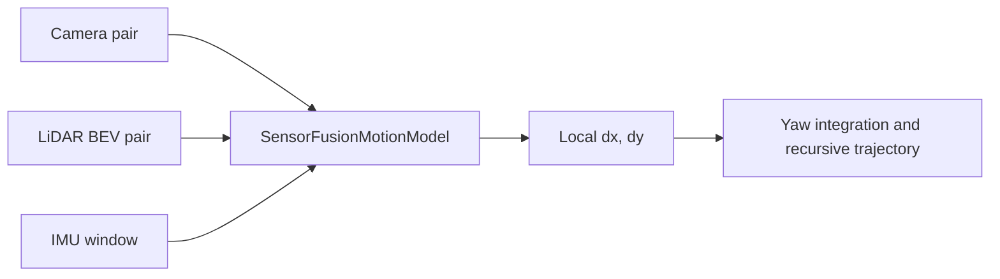

# Physics-Informed Sensor Fusion for Autonomous Vehicle Localization

This repository contains the implementation and experimental results of a master's thesis on vehicle localization during temporary GNSS unavailability.

The system uses synchronized **camera, LiDAR, and IMU data** to estimate local vehicle motion. The neural network predicts frame-to-frame planar translation, while deterministic equations integrate yaw, rotate the predicted motion into the global frame, and recursively update the trajectory from one initial position.

## Why this project matters

Phones and modern vehicles normally obtain their position from GNSS, mobile networks, maps, or external infrastructure. These sources can become unreliable in tunnels, underground areas, and urban canyons.

This project examines whether a vehicle can continue estimating its movement from onboard sensors after receiving only one initial global position. Its main contribution is not simply sensor fusion, but the controlled study of the difference between **accurate local motion prediction** and **long-term recursive localization**.

## Main contributions

- Temporal fusion of two camera frames, two LiDAR BEV frames, and a five-sample IMU window.
- An interpretable neural output: local displacement `[dx, dy]` in metres.
- Physics-guided yaw integration, coordinate rotation, and trajectory propagation.
- Drive-level KITTI splits designed to reduce temporal data leakage.
- Checkpoint selection using recursive validation ATE rather than one-step loss alone.
- Drift decomposition identifying route-dependent translation bias as the main error source.

## System workflow



The approach is **physics-guided** because physical coordinate transformations and state propagation are explicitly applied outside the network. It is not a classical differential-equation PINN.

## Model architecture

| Branch | Input | Encoder output |
|---|---|---:|
| Camera | Frames `t`, `t+1`, and their difference | 192 |
| LiDAR | BEV tensors `t`, `t+1`, and their difference | 192 |
| IMU | `5 x 6` accelerometer and gyroscope window | 128 |
| Fusion | Concatenated 512-dimensional feature | `[dx_m, dy_m]` |

The `SensorFusionMotionModel` contains **785,346 trainable parameters**. Its implementation is available in [`src/models/sensor_fusion.py`](src/models/sensor_fusion.py).

## Dataset

Experiments use synchronized drives from the **KITTI Raw dataset**. Raw KITTI files are not included in this repository.

| Split | Drives | Valid transitions | Purpose |
|---|---:|---:|---|
| Training | 16 | 19,483 | Model training |
| Validation | 3 | 2,121 | Model selection and diagnostics |
| Diagnostic Drive 0018 | 1 | 269 | Independent historical diagnostic |
| Final test | 3 | 2,197 | Evaluation after checkpoint freezing |
| **Total** | **23** | **24,070** | |

Drive assignments and frame pairs are provided in:

- [`results/new_drive_level_split.csv`](results/new_drive_level_split.csv)
- [`results/new_frame_pair_manifest.csv`](results/new_frame_pair_manifest.csv)

## Training

The loss combines:

- motion-weighted Smooth-L1 loss for `[dx, dy]`;
- `0.5 x` step-magnitude loss; and
- a stationary-motion penalty for target movement below `0.02 m`.

The canonical configuration uses AdamW, batch size `16`, initial learning rate `3e-4`, weight decay `1e-4`, gradient clipping at `5.0`, mixed precision on CUDA, and seed `42`.

The final checkpoint was selected at **epoch 3** using recursive validation ATE RMSE.

## Results

| Split | Local translation RMSE | Recursive ATE RMSE |
|---|---:|---:|
| Validation | **0.094 m** | **6.914 m** |
| Final test | **0.122 m** | **15.216 m** |

The local results show that the network learned useful frame-to-frame motion. However, small structured residuals accumulated during recursion, causing larger long-term trajectory error. All six tested drift-mitigation experiments performed worse than the frozen validation baseline, so the epoch-3 checkpoint was retained.

Detailed metrics, predictions, diagnostic tables, and figures are available under [`results/`](results/).

## Repository structure

```text
artifacts/canonical_epoch3/   Frozen checkpoint and training history
results/                      Metrics, predictions, manifests and figures
scripts/                      Training, evaluation and analysis scripts
src/models/                   SensorFusion model definition
config.py                     Canonical paths and experiment constants
requirements.txt              Python dependencies
```

## Installation

```bash
git clone https://github.com/ravitejaaaredla/Physics-Informed-Sensor-Fusion-for-Autonomous-Vehicle-Localization-using-Deep-Learning.git
cd Physics-Informed-Sensor-Fusion-for-Autonomous-Vehicle-Localization-using-Deep-Learning

python -m venv .venv
```

Activate the environment on Windows PowerShell:

```powershell
.\.venv\Scripts\Activate.ps1
```

Activate it on Linux or macOS:

```bash
source .venv/bin/activate
```

Install the dependencies:

```bash
python -m pip install --upgrade pip
pip install -r requirements.txt
```

## Verify the canonical checkpoint

Checkpoint path:

```text
artifacts/canonical_epoch3/best_model.pth
```

Expected SHA-256:

```text
ff210612469f6731dde7e5740aa84e91419a1470acc7a30585132a8aa4fd5f06
```

Windows PowerShell:

```powershell
(Get-FileHash .\artifacts\canonical_epoch3\best_model.pth -Algorithm SHA256).Hash.ToLower()
```

Linux or macOS:

```bash
sha256sum artifacts/canonical_epoch3/best_model.pth
```

The recorded final-test results can be inspected with:

```bash
python -m json.tool results/final_test_summary.json
```

## Reproducibility note

This thesis release includes the model definition, canonical checkpoint, manifests, predictions, metrics, and final figures. Full retraining additionally requires:

- the KITTI Raw sensor data;
- the dataset loader expected at `src/data/kitti_frame_pairs.py`; and
- experiment-specific checkpoint paths configured for the local machine.

The raw dataset and dataset-loader module are not included in the present repository snapshot. Therefore, the published results can be audited, but full end-to-end retraining requires these additional files.

## Limitations

- The model does not guarantee bounded global localization.
- Only one complete training seed is reported.
- Matched classical baselines and sensor-modality ablations were not completed.
- The estimated state is limited to planar translation with externally integrated yaw.
- Loop closure, map matching, uncertainty estimation, and online global correction are not included.

## Citation

```bibtex
@mastersthesis{aaredla2026sensorfusion,
  author = {Aaredla, Raviteja Reddy},
  title  = {Physics-Informed Sensor Fusion for Autonomous Vehicle Localization Using Deep Learning},
  school = {IU International University of Applied Sciences},
  year   = {2026}
}
```

## Acknowledgement

This thesis was completed under the supervision of **Dr. Aditya Mushyam**. The experiments use the KITTI Vision Benchmark Suite, whose data remain subject to the provider's terms.
